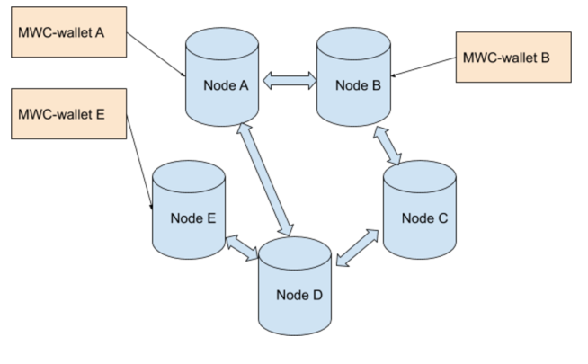

# Distributed Message pool,  traceability, Swap Marketplace


# Background.

We are going to introduce the improved traceability and swap marketplace feature. This 
document is describing the overall design, proc and cons.

# Distributed message pool.
Message pool is intended to maintain short live messages that are periodically refreshed by the wallets. 
Because of that, the message pool keeps only "fresh" data that is likely valid. 

Here is how the MWC network looks like.

We have multiple nodes that are organized into the network. Wallets normally connected to the different nodes.

This image is for illustration only. In reality there are much more nodes are running. But we will use this   



## Message Pool API

Node /v2/owner  API will be updated with two new methods:

**Put message into the pool:**

Request:
```
{
  "jsonrpc": "2.0",
  "method": "push_message",
  "params": {
     "Keys" : ["key1", "key2", … "keyN"],
     "Message" : "Any message in the text format. It can be Json",
     "Expiration" : 600,
  },
  "id": 1
}
```

Response:
```
{
  "id": 1,
  "jsonrpc": "2.0",
  "result": {
     "Ok": null
  }
}

```

Every message does have a hierarchy of the **keys**. For swap marketplace, btc buy offer can have keys like this 
["swap", "btc", "buy", ...].

**Message** can be anything that fit text string. The size of the String will be limited to some number large enough to 
fit possible messages.

**Expiration** time will define how long node is keeping this message into the pool. Node doesn’t track when the wallet 
goes offline, because of that, wallet will be required to update the message periodically.


**Wallet query the message pool.**

Request
```
{
  "jsonrpc": "2.0",
  "method": "query_message",
  "params": {
      "keys" : ["key1", "key2", ... "keyN"],
      "deepness" : 5,
      "size_limit" : 1000,
      "expiration" : 600
  },
  "id": 1
}
```
**keys**: index keys that will be used to request the data. We might add more complicated like requesting by rand if 
it is needed. But in the first version I think just value will be enough.

**deepness**: how deep go into connection graph. Will be covered below

**size_limit**: the total number of the messages to return. The rest will be ignored.

**expiration**: expiration time limit for the messages in case we don’t want to go forward with default expiration time. 

Response: 
```
{
  "id": 1,
  "jsonrpc": "2.0",
  "result": {
     "Ok": [
		{
			"Node" : "node address, tor or IP",
			"Keys" : ["key1", "key2", ... ,"keyN"],
			"Message" : "message value"
		},
	    ...
	]
  }
}
```
**Node**: node that has that data

**Keys**: index keys for that message.

**Message**: message value that wallet requested.

## Message Pool architecture.

Goals that we want to reach with this design:
 - Minimize the traffic. That is why we prefer polling instead of pushing.
 - Attack resistance. Attacker should not be able to push out messages of ‘honest players’.
 - Assuming that normally the wallet runs it’s own node.

To reach both goals, each node will maintain the local pool of messages. Message pool is in memory only and limited by size. 

**‘push_message’** update the message pool records at the local node. If message with such key already exist, it will be updated. 
Otherwise new record will be added. If pool size reach its limit, the node will remove the oldest message. 

Because push_message affects only one node and requires ‘secret_api’ knowledge, attacker can only flood it’s own node, 
or public cloud node. If every honest wallet runs it’s own node, attacker will not be able to push out ‘honest message’.

**‘query_message’**  initiate the network traversal with defined deepness. Every node will call connected nodes with this
request. Request can have requestId  to eliminate double processing.

For example, mwc-wallet B  calls Node B with deepness 3.  Node B will call C & A with deepness 2, A & C both call node D 
with deepness 1. Node D will return data to the first call and respond with empty data to the second call.  After each 
caller aggregate results and send them back. Eventually Node B will get the data from Nodes  C,A,D.  The aggregated 
results will be filtered by size_limit.  (first we delete records from the node that has most records)

# Swap marketplace 
Swap p2p process requires both wallets to be online.  Message pool with short lived message fit that mode pretty well. 

To place the order, wallet will public the message with key:  
[“swap”, “currency”, “buy/sell”, “mwc_lock_first”, “amount”, “swap_id”]

Message will contain all offer details that p2p swap deal has.

To request active offers, wallet can request all the records for the key.

For example all orders for btc:  [“swap”, “btc”]. All sell orders for btc [“swap”, “btc”, “sell”]

## Swap marketplace attacking.
Swap marketplace with just a message pool will work fine with all “honest” parties. But attackers can flood the
 message pool with a bunch of offers that will never be executed. For example, an attacker can place the order 
 but walk away on the locking step. As a result the host players will lock their MWC for some time.

Please note, all proofs are losing privacy, I don’t think we can be better.

Here is what we can do, just an ideas:
1. We can identify swap users with some public key. On the forum people can publish public keys. 
Signature with such PK can proof identity.

2. In theory we can validate that swaps were done in the past. Both party can provide the locking transaction details.
    - Buyer can provide BTC/BCH lock script, public key and signature. Lock script has hash 160 for that PK, so it is
     a proof that this deal did exist and BTC was locked.
    - Seller has multisig slate and part of it.  **Can we do something with that? Is it possible to proof that public 
    key is a part of Schnorr multisig?**
    

# Traceability

MWC naturally prevents tracing amounts and in the loaded networks it make very hard to trade payment between parties on
the blockchain. But monitoring transactions, it is possible to identify inputs/outputs that were involved into the same 
transaction. As a result with some heuristics and stat it is possible to trace the transactions even without amounts.

In order to prevent traceability ‘who pay who’ we can have two approaches:
1. Don’t broadcast transactions, collect them at the some ‘trusted’ node, do cut though and then mine. This method is 
easy to implement, but the confirmation time need to be very high and ‘trusted’ node is not what we want to have.
2. With every transaction, pay to few random wallets (let’s use term **decoy** for such payments). Amounts are hidden, so 
it will be really impossible to get which wallet get few nanocoins and what wallet get real amount.

Here we are focusing on the second option. I think it is make sense because monero does similar to hide traceability, 
but instead of real outputs that are using fake outputs as a decoy and it is where there is a weakness. Because those 
decoy are fake, after some time it becomes possible to isolate them. To beat that we can use real outputs that are 
not distinguishable from the ones with significant amounts.

Also with current fees calculations, inputs are reducing the fee. Wallets who accept such payments even with small amounts will benefit from that on fees.

Here is a FAQ of cons:
- **Transaction is larger, fees is higher.**  Yes, fees are higher, every additional output will cost 0.004 MWC.  
Larger transactions are not a problem until the block will be full. But when blocks become full, MW cut though and 
dandelion start working efficiently and this method will not be needed.
- **Network scalability.  Less number of outputs exist, smaller the blockchain size. The large number of small outputs
can flood the network.** Yes, it is really a large problem if decoy outputs are not spent. If decoy outputs are never spent, 
it will not help to solve traceability issue, but also degrade whole MWC network. That is why it is important to select 
wallets that are active. Below we will try to find a solution to that problem.
- **Still the number of active output will be 2,3 times higher. It will affect scalability.** Yes, it is true, but currently 
MWC footprint is pretty low, it doesn’t have much output. In the future, when traffic will be higher, the number of active 
outputs will be much larger and the network will need to handle such amount in any case. But when that moment happens, 
MW cut though and dandelion start working efficiently and decoys will not be needed any more.
- **Wallet selected outputs from small to larger. In this case those ‘small’ amount will be spent first. That will 
reveal real outputs.** Wallet output selection needs to be changed. Wallets need to select outputs randomly or use "all" logic. 
Non random selection will be easily discoverable with probability and heuristic methods.


## Payment workflow (Interactive Transactions)

Wallet A paying to Wallet B. At that moment there are many wallets push messgae at the message pool.
every message has wallet TOR address amd some proof of stakes.
 
Here are the steps.

1. Wallet A requesting online wallets that are ready to accept decoy coins. Any wallet that is online can do that. Wallet 
A requesting addresses with proofs from the message pool.
2. Selecting randomly wallets to pay. In our case Wallet C was found and selected. Let’s say there are few more wallets was found.
3. Wallet A at the end builds a transaction with output:  payment for Wallet B; change output; and decoy outputs for 
Wallet C or any other.
4. Slate SendInit message contains amount, kernel offset and participant data. So Wallet A builds separate messages for 
Wallet B and wallet C + others.  All those messages are sent in parallel. So wallet A can select any of the decoy responses.
5. Wallet A build a transactions with 3 output as planned at step #3 and publish it.

## Payment workflow (NIT)
Wallet A paying to Wallet B. At that moment there are many wallets push messgae at the message pool.
every message has wallet TOR address amd some proof of stakes.

Here are the steps.

1. Wallet A requesting online wallets that are ready to accept decoy coins. Any wallet that is online can do that. 
Wallet A requesting addresses with proofs from the message pool.
2. Selecting randomly wallets to pay. In our case Wallet C was found and selected. Let’s say there are few more 
wallets found.
3. Wallet A at the end builds a transaction with output:  payment for Wallet B; change output; and decoy outputs for 
Wallet C or any other. With NIT no interaction is needed, if address is knows, we can allways send some small amount of 
coins there.
4. Wallet A publish transaction.

## Attacking scenario

Attackers can create multiple wallets that will always be online. As a result they will collect most of the outputs. 
Because attackers know that those outputs are decoy, he will be able to identify the real outputs. Also those outputs 
will degrade the scalability. It is a really bad scenario for the long term.

## Definition of “Honest Wallet”

For traceability it is crucial to select active honest wallets. Also we should expect that attackers can create multiple 
fake (empty wallets) wallets to collect decoy outputs and never spend them. (If an attacker ever spends them - it is an honest player).

1. The transaction proof currently is the only way to connect the tor address are any activity that was happens. The proof 
has wallet address that is published. The problem is that proof reveals the wallet address, amount and set of inputs/outputs. 
Probably wallet can sacrifice some transactions to proof activity. Also transaction to self will work as well for such proof.
In order to make sure that the wallet is active, that transaction should be relatively fresh.

**More ideas how it is possible to validate if wallet was active?**

**Can we proof the ownership of the output without revealing the output veiw key?**

# Traceability with Multisig

Another method of reducing traceability is multisig that need to be done.

The idea is using natural MW feature by putting multiple inputs/output into the same multisig transactions.

Here is a workflow that illustrame an idea for example above.   

1. Wallets A, B, E  publish there addresses at message pool as ready to participate in such transaction. Wallets 
are publishing there public key (same that we use for slatepacks)

2. Randomly every wallet select the time to start. For example Wallet A starting this action. Wallet A 
selecting B & E to be part of the deal.

3. Wallet A creating transaction with one input and one (may be more) output to self. Transaction is encrypted
similar to slatepack and send to other parties (wallets B & E). Because only addressers can read the data, 
outside observer can't find out what inputs/outputs are in the slate.

4. Wallets A, B & E deciding who is collecting the outputs. It need to be random wallet, it is critical for security.
For Example, let's say Wallet E was elected.  

5. Other parties (Wallet B & E) adding one or more inputs and outputs into the same slate and send i back to 
wallet E. Slate will be encrypted so outside observer can't find out what inputs/outputs are in the slate.

6. Wallet E collecting response. Each response can be verified that sum of inputs/outputs is 0. Now Wallet E can
Build a single multisig transactions that include inputs/outputs from Wallets A, B and E.

7. Then all parties sign that transaction. How to sign such transaction is open question. The slate is posted.

As a result on this operation for any tracing tool it will be impossible to say what input/output belong to what wallet.
More wallets participate in the deal is better.

Also, wallet that collect outputs (wallet E) can tolerate is some walllet never respond back or refuse to process with multisig.

## Attacking

Becuase none of parties knows the amount and blinding factor of outputs, I think it is impossible to steal the funds.
For example Wallet E will not be able to remove outputs of wallet A and put there it's own out. So here we are good.

From that deal, all wallets that participate know the set of wallets that contribute and it is fine. Observer can get 
exactly the same information. Here there is no information leak.

Wallet that collect responsed at step #6 is the only one who can trace the inputs to outputs. If that wallet is not 
honets and it report about mapping, then this deal will not help for tracability. Because of that wallet that collect into
need to be elected randomly, so honest wallets will have a chance to process as well.

Another alternative is not elect the single wallet to collect thet data. We can collect in chunks, but the collector selection 
still need to be random. For example we have wallets A,B,C,D,E.  Wallet A can collect data from A,B,C.  D colelct from D & E.
Then C collect the results and initate multisig. This method may be more tolerant to non honest playes, but it is not 
resilient to problem when some wallet doesn't respond.

**What do you think?**

The election process is open question. We will continue with that later. There are are many possibilities, but let's
decide on the major details before go with minor.

# Traceability with Multikernel

Similar to multisig every participant can update the slate with it's own input/output and a kernel. The multikernel 
transactions are valid on the node. 

**The question: Will it be possible to separate the kernels with matched inputs/outputs?**  

## Attacking

The same what we have for Multisig. Data collector get information that allow to trace the data.

